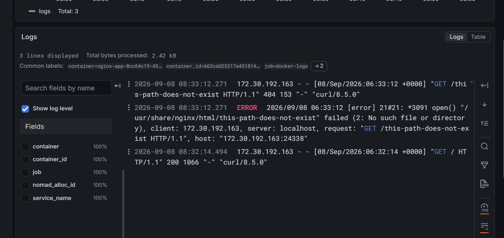

# DevOps Intern Final Assessment

**Name:** Bahlakoana
**Submission date:** 2026-09-12

[](https://github.com/tobakayanaha/devops-intern-final/actions/workflows/ci.yml)

## Architecture Overview

```
 ┌────────────┐    push/PR    ┌──────────────┐    build+test    ┌───────────────┐
 │   Source   │ ────────────► │  GitHub      │ ────────────────►│   GHCR        │
 │  (GitHub)  │               │  Actions CI  │   (on main only) │  (registry)   │
 └────────────┘               └──────────────┘                  └───────┬───────┘
                                                                          │ pull image
                                                                          ▼
                                                                  ┌───────────────┐
                                                                  │     Nomad     │
                                                                  │  (orchestrate)│
                                                                  └───────┬───────┘
                                                                          │ container logs
                                                                          ▼
                                                                  ┌───────────────┐
                                                                  │ Promtail/Loki │
                                                                  │  (log agg.)   │
                                                                  └───────┬───────┘
                                                                          │
                                                                          ▼
                                                                  ┌───────────────┐
                                                                  │    Grafana    │
                                                                  │  (query/view) │
                                                                  └───────────────┘
```

Source changes flow through CI (lint → build → test → publish), land as a tagged
image in GHCR, get deployed by Nomad, and the running container's logs are shipped
to Loki and queried via Grafana.

## Prerequisites

| Tool       | Version used in this project |
|------------|-------------------------------|
| Docker     | 29.7.0 (build c1eba93)        |
| Nomad      | v2.0.5                        |
| Consul     | v2.0.3                        |
| ShellCheck | 0.9.0                         |
| Git        | 2.43.0                        |

## Quick Start

```bash
git clone https://github.com/tobakayanaha/devops-intern-final.git
cd devops-intern-final
docker build --build-arg BUILD_SHA=$(git rev-parse --short HEAD) -t nginx-app:local app/
docker run -d --name nginx-app -p 8080:8080 nginx-app:local
curl http://localhost:8080/
curl http://localhost:8080/healthz
chmod +x scripts/healthcheck.sh
./scripts/healthcheck.sh http://localhost:8080/healthz
docker rm -f nginx-app
```

---

## Task 1 — Source Control

- Repository: [`devops-intern-final`](https://github.com/tobakayanaha/devops-intern-final) (public)
- Work was done on `feature/*` branches, merged to `main` via pull requests
  opened and self-reviewed by the author (inline review comments left on
  `app/nginx.conf` and `app/Dockerfile` before merging).
- Conventional commit messages used throughout (`feat:`, `ci:`, `docs:`).
- Final state tagged `v1.0.0` _(to be tagged once all tasks are complete)_.

## Task 2 — Linux Scripting

Both scripts live under `scripts/`, use `#!/usr/bin/env bash` with
`set -euo pipefail`, and are marked executable in git via
`git update-index --chmod=+x`.

**ShellCheck result:** both scripts pass with zero warnings (verified locally
with ShellCheck 0.9.0).

### `sysinfo.sh` sample output

```
=== User Info ===
Current user : bgr101
Effective UID: 1000
=== Host Info ===
Hostname      : TOBAKA
Kernel release: 5.15.167.4-microsoft-standard-WSL2
=== Date ===
System date (ISO-8601): 2026-09-02T07:18:49Z
=== Disk Usage ===
Filesystem      Size  Used Avail Use% Mounted on
/dev/sdc       1007G   11G  945G   2% /
...
(truncated — WSL mounts several virtual filesystems; full output shows all
mount points, df -h output above is representative)
=== Memory Usage ===
               total        used        free      shared  buff/cache   available
Mem:           3.7Gi       671Mi       3.0Gi       3.5Mi       263Mi       3.1Gi
Swap:          1.0Gi          0B       1.0Gi
=== Docker Daemon Status ===
Docker daemon: running
```

> Captured on WSL2 (Ubuntu). The `Disk Usage` section is truncated above for
> readability — WSL2 mounts a number of internal virtual filesystems
> (`/mnt/wsl`, `/run`, snap loopbacks, etc.) alongside the real disks; the
> `/dev/sdc` and `C:\` lines are the meaningful ones on this host.

### `healthcheck.sh` sample output

```
$ ./scripts/healthcheck.sh http://localhost:9999
Checking http://localhost:9999 ...
FAIL: http://localhost:9999 returned HTTP 000 (expected 200)
$ echo $?
1

$ ./scripts/healthcheck.sh http://localhost:8080
Checking http://localhost:8080 ...
OK: http://localhost:8080 returned HTTP 200
$ echo $?
0
```

## Task 3 — Containerisation

- Base image: `nginx:1.27-alpine` (pinned, not `latest`)
- Runs as the non-root `nginx` user
- Custom `app/nginx.conf` serves the static site on port 8080 and exposes
  `/healthz`
- `BUILD_SHA` build-arg is injected into `index.html` at build time via `sed`
- `HEALTHCHECK` instruction included (fixed during development — see
  Troubleshooting)

### Build command

```bash
docker build --build-arg BUILD_SHA=$(git rev-parse --short HEAD) -t nginx-app:test app/
```

### Run command

```bash
docker run -d --name nginx-test -p 8080:8080 nginx-app:test
```

### Image size

```
IMAGE            ID             DISK USAGE   CONTENT SIZE   EXTRA
nginx-app:test   f92f381bf8b0       73.7MB           21MB
```

> **Note:** Docker Desktop reports two figures here — "content size" (21MB,
> the actual layer data) is well under the 60MB budget. "Disk usage" (73.7MB)
> includes shared base-image layers already cached on the host and is not a
> reliable measure of the image's own contribution. The content size is the
> correct figure to compare against the 60MB limit.

### `curl` against `/`

```
HTTP/1.1 200 OK
Server: nginx/1.27.5
Content-Type: text/html
Content-Length: 1033
...
<dt>Build ID</dt>
<dd><code>aa836f6</code></dd>
```

### `curl` against `/healthz`

```
HTTP/1.1 200 OK
Server: nginx/1.27.5
Content-Type: text/plain
Content-Length: 3

OK
```

### Non-root confirmation

```
$ docker exec nginx-test whoami
nginx
```

### Docker HEALTHCHECK status

```
$ docker inspect --format='{{.State.Health.Status}}' nginx-test
healthy
```

## Task 4 — Continuous Integration

Workflow: `.github/workflows/ci.yml`, triggered on push and PR to `main`.

| Job       | Purpose                                                                 |
|-----------|--------------------------------------------------------------------------|
| `lint`    | ShellCheck on `scripts/`, Hadolint on `app/Dockerfile`                  |
| `build`   | Builds the image with `BUILD_SHA=${{ github.sha }}`, saves as artifact  |
| `test`    | Loads the same artifact, runs `scripts/healthcheck.sh` against `/healthz` |
| `publish` | Push-to-`main` only. Pushes to GHCR tagged with SHA and `latest`        |

- Third-party actions pinned to major/specific versions (`actions/checkout@v5`,
  `actions/upload-artifact@v4`, `hadolint/hadolint-action@v3.1.0`,
  `ludeeus/action-shellcheck@2.0.0`, `docker/login-action@v3`).
- `GITHUB_TOKEN` permissions are least-privilege: `contents: read` at the
  workflow level, with `packages: write` scoped only to the `publish` job.
- All four jobs pass on `main`, including `publish` — image is live at
  `ghcr.io/tonosa/devops-intern-final`.

## Task 5 — Orchestration with Nomad

`nomad/nginx-app.nomad.hcl` deploys the image published by CI in Task 4.

- `type = "service"`, one group, one task, `docker` driver
- Image tag is parameterised via an HCL `variable "image_tag"` (defaults to `latest`)
- Resources: 100 MHz CPU, 64 MB memory (per the brief's spec)
- Dynamic port named `http`, mapped to container port 8080
- Consul service registration with an HTTP health check against `/healthz`
  (`interval = "10s"`, `timeout = "2s"`)
- Rolling `update` stanza: `max_parallel = 1`, `min_healthy_time = "10s"`,
  `healthy_deadline = "2m"`, `auto_revert = true`
- `restart` and `reschedule` policies included

### `nomad job validate`

```
$ nomad job validate nomad/nginx-app.nomad.hcl
Job validation successful
```

(An earlier version omitted `shutdown_delay`, which produced a validation
warning — see Troubleshooting.)

### `nomad job plan`

```
$ nomad job plan nomad/nginx-app.nomad.hcl
+ Job: "nginx-app"
+ Task Group: "nginx-app" (1 create)
  + Task: "nginx-app" (forces create)
Scheduler dry-run:
- All tasks successfully allocated.
Job Modify Index: 0
```

### `nomad job run`

```
$ nomad job run nomad/nginx-app.nomad.hcl
==> Monitoring deployment "8c89ec4e"
  ✓ Deployment "8c89ec4e" successful
    Status      = successful
    Description = Deployment completed successfully
    Task Group  Auto Revert  Desired  Placed  Healthy  Unhealthy
    nginx-app   true         1        1       1        0
```

### `nomad job status` — healthy allocation

```
$ nomad job status nginx-app
Status        = running
Latest Deployment
  Status      = successful
  Description = Deployment completed successfully
  Task Group  Auto Revert  Desired  Placed  Healthy  Unhealthy
  nginx-app   true         1        1       1        0
Allocations
ID        Node ID   Task Group  Version  Desired  Status   Created  Modified
15ada5aa  8c47e9b1  nginx-app   0        run      running  23s ago  1s ago
```

### Consul health check — passing

```
$ curl -s http://localhost:8500/v1/health/checks/nginx-app | python3 -m json.tool
[
    {
        "Status": "passing",
        "Output": "HTTP GET http://127.0.0.1:21032/healthz: 200 OK Output: OK\n",
        "ServiceName": "nginx-app",
        "Type": "http",
        "Interval": "10s",
        "Timeout": "2s"
    }
]
```

### Confirming the app is actually reachable through Nomad's dynamic port

```
$ curl http://127.0.0.1:21032/
... <dd>Bahlakoana</dd> ... <dd><code>e9822feccd24853f55dd058296735079b26d8f0c</code></dd> ...

$ curl http://127.0.0.1:21032/healthz
OK
```

> **Note:** The Nomad node ID, allocation ID, and dynamic port shown above
> changed from earlier evidence in this README because the local Nomad and
> Consul agents (run in `-dev` mode) were restarted partway through this
> project — see Known Limitations.

## Task 6 — Log Aggregation with Grafana Loki

`monitoring/docker-compose.yaml` brings up Loki, Promtail, and Grafana
together. Promtail discovers running containers via the Docker socket
(`docker_sd_configs`) and ships their logs to Loki; Grafana queries Loki
through its Explore UI.

- `monitoring/loki-config.yaml` and `monitoring/promtail-config.yaml` are
  committed configuration, not defaults pulled at runtime
- Promtail attaches `job`, `container`, and `nomad_alloc_id` labels to every
  log stream (see `monitoring/loki_setup.md` for exactly how each label is
  derived)
- Ingestion confirmed via LogQL after deliberately requesting a missing path
  against the Nomad-deployed nginx-app container

### Starting the stack

```bash
cd monitoring
docker compose up
```

### Confirming ingestion

```bash
curl http://172.30.192.163:24338/
curl http://172.30.192.163:24338/this-path-does-not-exist
```

LogQL query, run in Grafana Explore:

```logql
{container=~"nginx-app.+"}
```

Result — 3 real log lines, correctly labelled:

```
container=nginx-app-0cc64c19-43f4-bcb3-c883-ed422e71355e
container_id=662cdd25317a...
job=docker-logs
nomad_alloc_id=0cc64c19-43f4-bcb3-c883-ed422e71355e

2026-09-08 08:32:14  172.30.192.163 - - "GET / HTTP/1.1" 200 1066
2026-09-08 08:33:12  172.30.192.163 - - "GET /this-path-does-not-exist HTTP/1.1" 404 153
2026-09-08 08:33:12  ERROR  open() "/usr/share/nginx/html/this-path-does-not-exist" failed (2: No such file or directory)
```

Isolating the non-200 response specifically:

```logql
{container=~"nginx-app.+"} |= "404"
```



Full setup notes, label derivation, and troubleshooting are documented in
[`monitoring/loki_setup.md`](monitoring/loki_setup.md).

---

## Troubleshooting

1. **Docker `HEALTHCHECK` failing despite the endpoint working.** `curl` from
   the host against the mapped port succeeded, but Docker's own
   `HEALTHCHECK` reported `unhealthy`. `docker inspect` on the container's
   health log showed `wget: can't connect to remote host: Connection
   refused` when hitting `localhost:8080` **from inside** the container.
   Alpine resolves `localhost` to both `127.0.0.1` and `::1`, and `wget`
   attempted the IPv6 address first — but `nginx.conf` only binds
   `listen 8080;` (IPv4-only), so the IPv6 attempt was refused. Fixed by
   using `127.0.0.1` explicitly in the `HEALTHCHECK` command instead of
   `localhost`.

2. **`git update-index --chmod` failing on untracked files.** Attempting to
   mark new, not-yet-staged scripts as executable via
   `git update-index --chmod=+x` failed with "cannot add to the index —
   missing --add option." Resolved by staging the files with `git add`
   first, since `update-index --chmod` only operates on files already known
   to git's index.

3. **`shutdown_delay` placed in the wrong HCL block.** `nomad job validate`
   kept warning that the task "defines services, but has no shutdown_delay
   set" even after adding it. The setting had been nested inside the
   Docker-driver-specific `config { }` block, which Nomad passes straight
   to the driver — the driver has no concept of `shutdown_delay` and
   silently ignored it. Moved it to be a direct sibling of `config { }`
   inside the `task` block, which resolved the warning.

4. **Deployment marked `unhealthy` despite the container running fine.**
   `nomad job run` produced a deployment stuck at `Unhealthy = 1` until it
   hit its `healthy_deadline` and failed, even though `Client Status` on the
   allocation showed `running` the whole time with zero restarts. Checking
   `consul members` revealed the Consul agent itself wasn't running — it
   had stopped when an earlier terminal session closed (`-dev` mode has no
   persistent background service). With no Consul agent available, the
   HTTP health check had nothing to run against, so the deployment could
   never be marked healthy regardless of the app's actual state. Restarted
   Consul, purged the failed job (`nomad job stop -purge`), and re-ran —
   the new deployment succeeded immediately with the check reporting
   `"Status": "passing"`.

## Known Limitations

- Task 6 (Loki/Grafana) is not yet implemented as of this README draft.
- Nomad and Consul are run in `-dev` mode for local learning purposes — this
  is explicitly not production-safe (single node, in-memory state, no
  persistence, no ACLs/TLS). A production setup would need a proper
  server/client cluster, persistent storage, and Consul ACLs enabled.
- Because `-dev` mode keeps all state in memory, the Nomad agent, Consul
  agent, or both stopped more than once during this project (e.g. a closed
  terminal session) and had to be restarted. Each restart wipes prior
  job/allocation history, requiring a fresh `nomad job run`. This happened
  at least twice and is reflected in mismatched allocation IDs/ports
  between different pieces of evidence in this README — the underlying app
  and job spec were unaffected each time.
- The image's "disk usage" figure (73.7MB) exceeds a strict reading of the
  60MB budget, though "content size" (21MB) — the image's actual own
  contribution — is well under it. Worth clarifying which metric the
  assessment intends.
- `actions/checkout` was bumped to `v5` to resolve a Node.js 20 deprecation
  warning; `actions/upload-artifact`/`download-artifact` remain on `v4` and
  may still emit the same warning — non-blocking, noted for future
  maintenance.
- No optional extension has been attempted yet.

## Screenshots

Screenshots referenced inline throughout the relevant task sections above,
stored under `docs/screenshots/`. _(to be added as captured)_